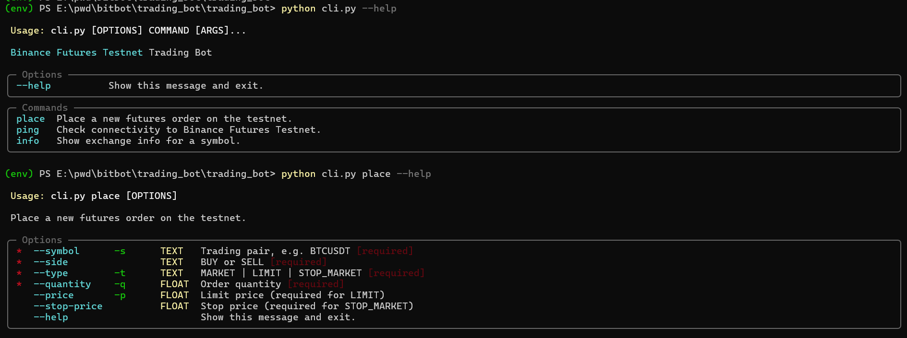

#  Binance Futures Testnet Trading Bot

A clean, extensible Python CLI trading bot for **Binance USDT-M Futures Testnet**.

---

## Features

| Feature | Detail |
|---|---|
| Order types | MARKET, LIMIT, STOP_MARKET (bonus) |
| Sides | BUY and SELL |
| CLI | [Typer](https://typer.tiangolo.com/) with [Rich](https://rich.readthedocs.io/) formatting |
| Logging | Dual handler — file (`logs/trading.log`) + console warnings |
| Validation | Clean error messages before any API call is made |
| Error handling | Typed exceptions for API errors, network failures, auth issues |
| Architecture | Layered: CLI → Validator → OrderService → BinanceFuturesClient |

---

## Project Structure

```
trading_bot/
│
├── bot/
│   ├── __init__.py
│   ├── client.py          # Signed REST client for Binance Futures Testnet
│   ├── orders.py          # Business logic / OrderService
│   ├── validators.py      # Input validation
│   ├── exceptions.py      # Custom exception hierarchy
│   ├── logging_config.py  # File + console logging setup
│   └── config.py          # Environment variables & constants
│
├── logs/
│   └── trading.log        # Created at runtime
│
├── sample_logs/
│   ├── market_order.log   # Sample MARKET order log
│   └── limit_order.log    # Sample LIMIT order log
│
├── cli.py                 # CLI entry point
├── .env.example           # Template for credentials
├── .env                   # Your credentials (never commit this)
├── .gitignore
├── requirements.txt
└── README.md
```

---

## Supported Order Types

| Order Type  | Required Fields                    | Status                               |
| ----------- | ---------------------------------- | ------------------------------------ |
| MARKET      | symbol, side, quantity             |  Supported                          |
| LIMIT       | symbol, side, quantity, price      |  Supported                          |
| STOP_MARKET | symbol, side, quantity, stop_price |  Experimental (Testnet limitations) |

---

## Setup

### 1. Get Testnet Credentials

1. Go to [https://testnet.binancefuture.com](https://testnet.binancefuture.com)
2. Log in with your GitHub account
3. Navigate to **API Management** → generate a key pair
4. Copy the **API Key** and **Secret Key**

### 2. Clone / Download

```bash
git clone <your-repo-url>
cd trading_bot
```

### 3. Create a Virtual Environment

```bash
python -m venv venv
source venv/bin/activate        # macOS/Linux
venv\Scripts\activate           # Windows
```

### 4. Install Dependencies

```bash
pip install -r requirements.txt
```

### 5. Configure Credentials

```bash
cp .env.example .env
```

Edit `.env`:

```env
BINANCE_API_KEY=your_testnet_api_key_here
BINANCE_SECRET_KEY=your_testnet_secret_key_here
```

---

## Usage

### Check Testnet Connectivity

```bash
python cli.py ping
```

### View Symbol Info

```bash
python cli.py info --symbol BTCUSDT
```

### Place a MARKET Order

```bash
python cli.py place \
  --symbol BTCUSDT \
  --side BUY \
  --type MARKET \
  --quantity 0.001
```

### Place a LIMIT Order

```bash
python cli.py place \
  --symbol BTCUSDT \
  --side SELL \
  --type LIMIT \
  --quantity 0.001 \
  --price 68000
```

### (Bonus Feature) Place a STOP_MARKET Order
(Note: STOP_MARKET was implemented as an optional bonus feature,
however Binance Futures Testnet currently restricts some advanced
order types on standard endpoints.)
```bash
python cli.py place \
  --symbol BTCUSDT \
  --side SELL \
  --type STOP_MARKET \
  --quantity 0.001 \
  --stop-price 60000
```

### Help

```bash
python cli.py --help
python cli.py place --help
```

---

## Example Output

```
╭─────────────────────────────╮
│     ORDER REQUEST SUMMARY   │
├──────────────┬──────────────┤
│ Symbol       │ BTCUSDT      │
│ Side         │ BUY          │
│ Type         │ LIMIT        │
│ Quantity     │ 0.001        │
│ Price        │ 65000.0      │
╰──────────────┴──────────────╯

╭─────────────────────────────╮
│        ORDER RESPONSE       │
├────────────────┬────────────┤
│ Order ID       │ 3968428    │
│ Symbol         │ BTCUSDT    │
│ Side           │ BUY        │
│ Type           │ LIMIT      │
│ Status         │ NEW        │
│ Original Qty   │ 0.001      │
│ Executed Qty   │ 0          │
│ Avg Price      │ 0.00       │
╰────────────────┴────────────╯

  Order placed successfully!
```

---

## Logging

All activity is logged to `logs/trading.log`:

```
2026-05-08 12:30:10  INFO     trading_bot — Placing MARKET order: symbol=BTCUSDT side=BUY qty=0.001
2026-05-08 12:30:11  INFO     trading_bot — Order placed successfully: orderId=3968428 status=FILLED
```

Log levels:
- **DEBUG** — raw request/response params (file only)
- **INFO** — order lifecycle events
- **WARNING** — non-fatal issues (e.g. price given for MARKET order)
- **ERROR** — API errors, validation failures, network issues

---

## Tech Stack

| Component | Library |
|---|---|
| Language | Python 3.10+ |
| CLI | Typer |
| Pretty output | Rich |
| HTTP | requests |
| Env vars | python-dotenv |

## Screenshots





---

## Assumptions

1. **Testnet only** — The base URL is hardcoded to `https://testnet.binancefuture.com`. Do not use production keys.
2. **USDT-M Futures** — Designed for the perpetual futures market, not spot or COIN-M futures.
3. **GTC** — All LIMIT orders use `timeInForce=GTC` (Good Till Cancelled).
4. **No leverage management** — Leverage/margin mode must be set in the testnet UI before running orders.
5. **Quantity precision** — Binance enforces step-size filters per symbol. Use `python cli.py info --symbol BTCUSDT` to check valid quantities.

---

## Error Handling

| Scenario | Behaviour |
|---|---|
| Missing `.env` credentials | Clear `ConfigurationError` before any API call |
| Invalid CLI input | `ValidationError` with descriptive message, no API call made |
| Binance API rejection | `BinanceClientError` with Binance error code and message |
| Network timeout | `NetworkError`, retried up to 3 times with backoff |
| Authentication failure | `AuthenticationError` with guidance |

---

## Future Enhancements

- WebSocket price stream for real-time order tracking
- OCO (One-Cancels-Other) order support
- TWAP execution strategy
- SQLite trade log / history
- FastAPI or Telegram Bot interface
- Multi-symbol portfolio support
